  

# Facedetect App
The purpose of this app is to allow users to perform face detection on any image that is submitted to the server. This face detection capability is provided thanks to the `Clarifai Cloud API`. The app maintains also a count of the requests performed by each user.
The app supports user registration and signin. 
As the above diagram shows, the Frontend relies on `React.js`, while the API service has been built around `Node.js` and `Express`.
User information is stored on a `PostgreSQL` database, using a `users` and a `login` table. 
Communication between the API server and the database happens thanks to the `Knex.js` library. Password security is provided by the use of the `BCrypt-node` library.

## Frontend
The Frontend is built using React in a modular fashion, using mainly UI components sourced from the `Tachyons` toolkit. The `App.js` file represents the top level structure of the app, where the different components from the `components` folder are instantiated.

## Backend
The Backend is also built in a hierarchical fashion, with the `server.js` file containing the description of the endpoints provided by the API. Here the calls received are dispatched to the appropriate `controller` function, in the `controllers` folder, for further processing. The API has been tested with the Postman tool before being connected to the Frontend.

## Deployment
A live version of the App is available on Heroku at the address: [https://facedetect-react.herokuapp.com](https://facedetect-react.herokuapp.com)
Frontend, Backend and Database are all hosted on Heroku.